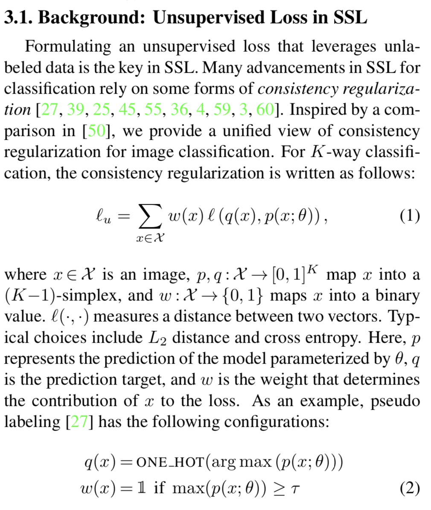
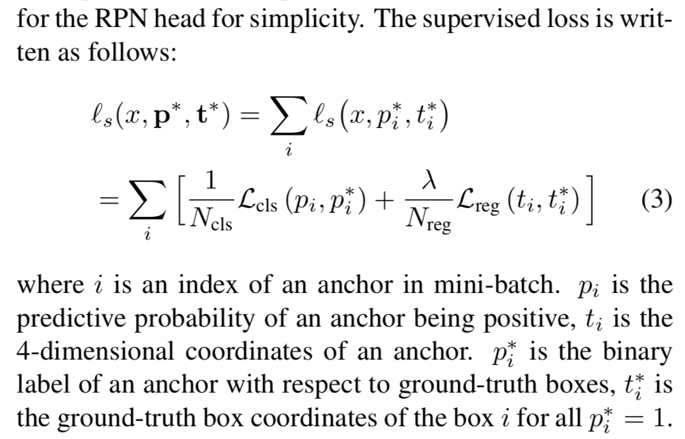
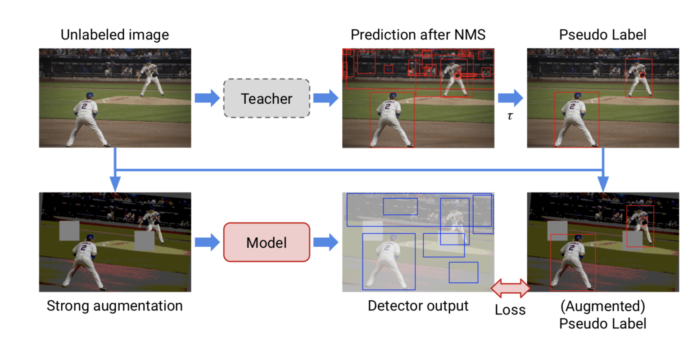
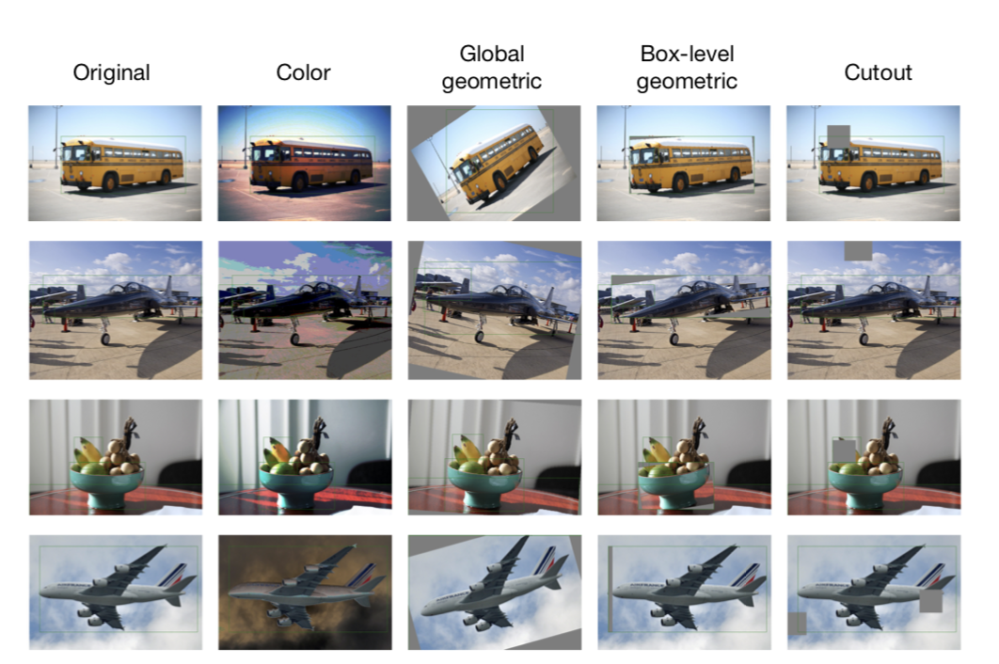
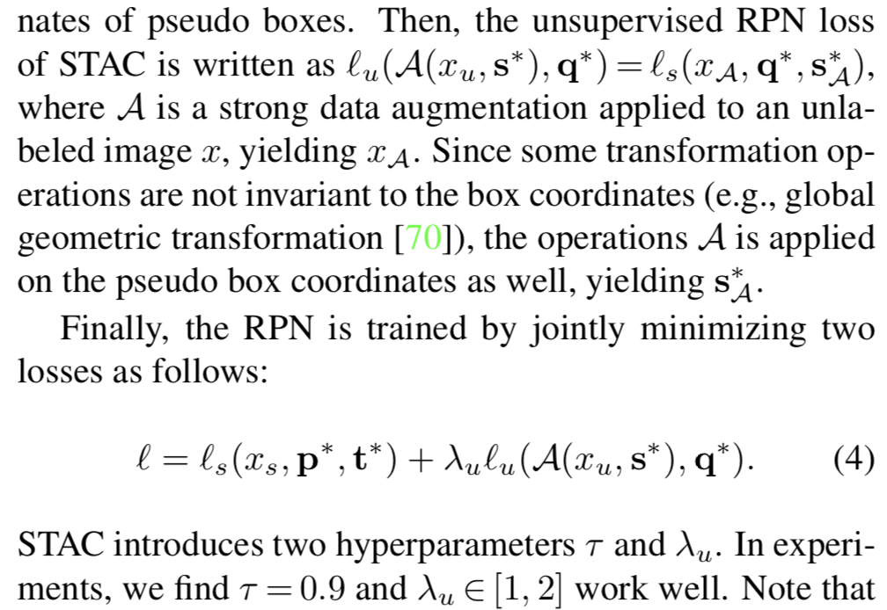

[A Simple Semi-Supervised Learning Framework for Object Detection](https://arxiv.org/pdf/2005.04757.pdf)

[github_repo](https://github.com/google-research/ssl_detection)
STAC provides a semi supervised learning algorithm for object detection taks. STAC stands for  Self-Training (via pseudo label) and the Augmentation driven Consistency regularization.

stages

1. Train a teacher model on available labeled images.
2. Generate pseudo labels of unlabeled images (i.e., bounding boxes and their class labels) using the trained
teacher model.
3. Apply strong data augmentations to unlabeled images, and augment pseudo labels (i.e. bounding boxes) correspondingly when global geometric transforma- tions are applied.
4. Compute unsupervised loss and supervised loss to train a detector.

[Overfeat](https://towardsdatascience.com/object-localization-in-overfeat-5bb2f7328b62)

## Training a Teacher model:

 - Uses a Faster R-CNN model, which is one of the most representative model in the object detection.

 - Faster RCNN has a classifier (CLS) and a region proposal network (RPN) heads on top of the shared backbone network. Each head has two modules, namely 
    - region classifiers (e.g., a (K+1)- way classifier for the CLS head or a binary classifier for the RPN head). K classes in training dataset and 1 class for background.
    - bounding box regressors (REG)

    

## Generating pseudo labels:

 - Perform a test time inference for object detection using the Teacher model

 - Use the score of each returned bounding box after NMS and then apply confidence-based thresholding to further reduce potentially wrong pseudo boxes.

## Data Augmentation Strategy:

1. Global color transformation (C): Color transformation operations and the suggested ranges of magnitude for each operation are used.
2. Global geometric transformation (G): Geometric transformation operations, namely, x-y translation, rotation, and x-y shear, are used.
3. Box-level transformation (B): Three transformation operations from global geometric transformations are used, but with smaller magnitude ranges.

For each image apply transformation operations in sequence as follows.
  
  - Apply one of the operations sampled from C. 
  - Apply one of the operations sampled from either G or B. 
  - Finally, apply Cutout at multiple random locations of a whole image. This prevents a trivial solution when applied exclusively inside the bounding box. 
  
 We visualize transformed images with aforementioned augmentation strategies in figure below.

 

 ## Compute unsupervised loss and supervised loss:

 Determine `q`_i *, a binary label of an anchor `i` with respect to pseudo boxes, for all anchors.
 Simple threshold mechanism w in Equation (2) is applied on `q`_i * using the CLS head, so it is 1 if anchor is associated with any pseudo boxes whose CLS prediction confidence scores of teacher model are higher than the threshold `τ` and 0 otherwise (i.e. treated as background).

 

 Recommended range for `λu` is [1, 2]. The best performance of STAC is obtained when `λu` = 2 and `τ` = 0.9.