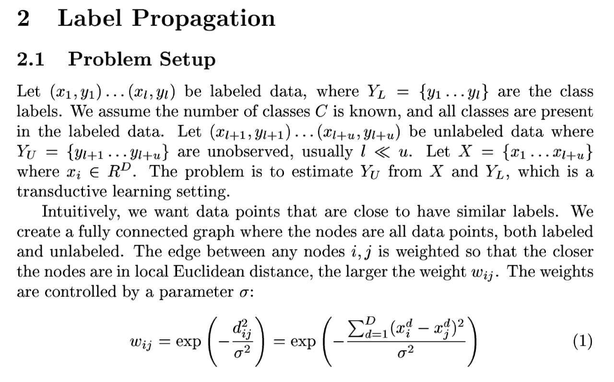
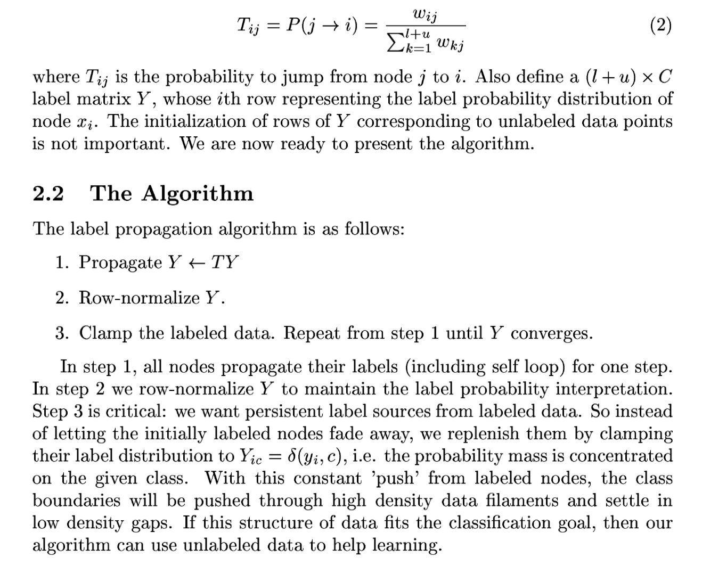

There two existing algorithms available for semi supervised learning in sklearn. Both methods works by implementing a similarity matrix on the whole training dataset (including labelled and unlabelled dataset) and then updating the labels based on the similarity.

## [Learning from labelled and unlablled data with label propogation](http://pages.cs.wisc.edu/~jerryzhu/pub/CMU-CALD-02-107.pdf)




## [Notes from user guide of sklearn](https://sklearn.org/modules/label_propagation.html#label-propagation)
LabelPropagation and LabelSpreading differ in modifications to the similarity matrix that graph and the clamping effect on the label distributions. Clamping allows the algorithm to change the weight of the true ground labeled data to some degree. The LabelPropagation algorithm performs hard clamping of input labels, which means `alpha=0`. This clamping factor can be relaxed, to say `alpha=0.2`, which means that we will always retain 80 percent of our original label distribution, but the algorithm gets to change its confidence of the distribution within 20 percent.


Implementation in [sklearn](https://github.com/scikit-learn/scikit-learn/blob/a24c8b46/sklearn/semi_supervised/label_propagation.py#L204-L299):

```python
y_static = np.copy(self.label_distributions_)
if self._variant == 'propagation':
    # LabelPropagation
    y_static[unlabeled] = 0
else:
    # LabelSpreading
    y_static *= 1 - alpha

l_previous = np.zeros((self.X_.shape[0], n_classes))

unlabeled = unlabeled[:, np.newaxis]
if sparse.isspmatrix(graph_matrix):
    graph_matrix = graph_matrix.tocsr()

for self.n_iter_ in range(self.max_iter):
    if np.abs(self.label_distributions_ - l_previous).sum() < self.tol:
        break

    l_previous = self.label_distributions_
    self.label_distributions_ = safe_sparse_dot(
        graph_matrix, self.label_distributions_)

    if self._variant == 'propagation':
        normalizer = np.sum(
            self.label_distributions_, axis=1)[:, np.newaxis]
        self.label_distributions_ /= normalizer
        self.label_distributions_ = np.where(unlabeled,
                                             self.label_distributions_,
                                             y_static)
    else:
        # clamp
        self.label_distributions_ = np.multiply(
            alpha, self.label_distributions_) + y_static
    self.n_iter_ += 1

normalizer = np.sum(self.label_distributions_, axis=1)[:, np.newaxis]
self.label_distributions_ /= normalizer
```